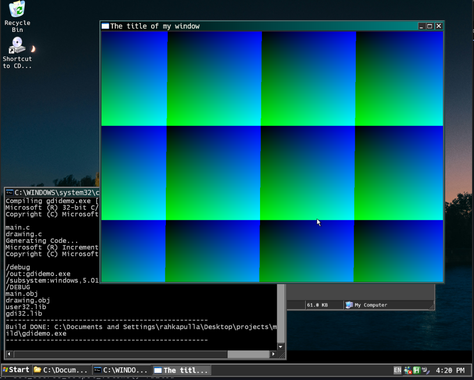

# minimal-gdi

A minimal Win32 GDI template in C created while watching Handmade Hero. It scaffolds a basic window, initializes a custom software pixel buffer via a DIB section, runs a real-time rendering loop to animate a gradient, and includes an MSVC compilation batch script targeting modern Windows as well as Windows XP (32-bit).



---

## How to run?

Build:
```console
.\build.bat
